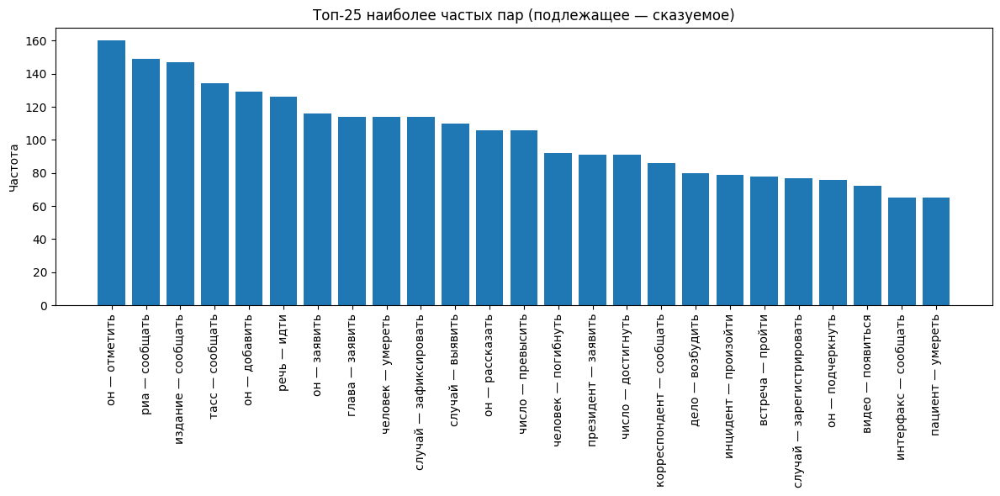

# Задача 1: Лингвистика и синтаксический разбор текстовых данных

## Данные

В работе использован датасет Russian News 2020 (Kaggle).
Загружено 5 000 новостей. После сегментации получено:
**72 887 предложений.**

Для анализа использовалась колонка `title,text`.

## Используемые инструменты

- `pandas` — загрузка данных  
- `natasha` — синтаксический разбор 
- `pymorphy2` — лемматизация
- `collections.Counter` — подсчёт частот  
- `matplotlib` — визуализация

## Алгоритм

1. Разбиение текстов на предложения `Natasha`.
2. Синтаксический анализ каждого предложения
3. Поиск сказуемого: токен с зависимостью  `root`.
4. Поиск подлежащего: токен с зависимостью `nsubj` - связанный с `root`
5. Проверяем связь подлежащего со сказуемым - `head_id` подлежащего == `id` сказуемого.
6. Лемматизация через `pymorphy2`.
7. Подсчёт частот пар через `Counter`
## Результаты 

Топ-10 наиболее частых сочетаний:
- он - отметить: 160
- риа - сообщать: 149
- издание - сообщать: 147
- тасс - сообщать: 134
- он - добавить: 129
- речь - идти: 126
- он - заявить: 116
- глава - заявить: 114
- человек - умереть: 295  
- случай - зафиксировать: 266

##Ограничения

Составные подлежащие ("98% людей", "несколько человек") учитываются частично — только первый токен с зависимостью nsubj
Деепричастные обороты могут искажать связь подлежащее–сказуемое
В сложных предложениях извлекается только одна пара (по главному корню)

Также построена столбчатая диаграмма для топ-25 сочетаний:

## Вывод

Полученные результаты отражают специфику новостного корпуса Russian News 2020:
Источники информации: частые упоминания агентств — "риа", "тасс", "издание" + глагол "сообщать"
Глаголы речи: доминируют "сообщать", "заявить", "отметить", "добавить" — характерно для журналистского стиля
Местоимения: "он" в топ-3 подлежащих — типично для новостных текстов с отсылкой к ранее упомянутым лицам
Устойчивые конструкции: "речь — идти", "случай — зафиксировать" — новостные клише
Тематика: пары "человек — умереть", "случай — зафиксировать" указывают на наличие новостей о происшествиях
